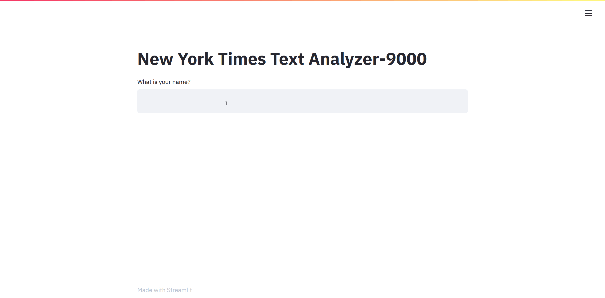
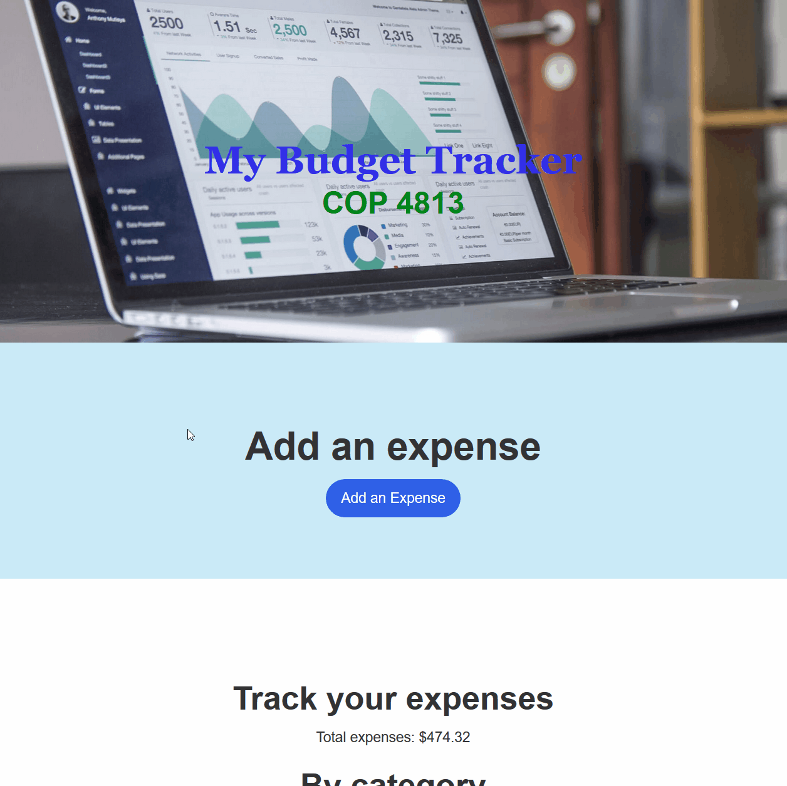

### Hi there 👋

<!--
**Jpere905/Jpere905** is a ✨ _special_ ✨ repository because its `README.md` (this file) appears on your GitHub profile.

- 🔭 I’m currently working on ...
- 🌱 I’m currently learning ...
- 👯 I’m looking to collaborate on ...
- 🤔 I’m looking for help with ...
- 💬 Ask me about ...
- 📫 How to reach me: ...
- 😄 Pronouns: ...
- ⚡ Fun fact: ...
-->

### Some of my most recent projects:
### NYT Text Analyzer 
Used Python and the Natural Language Tool Kit (NLTK) to analyze frequency of word occurrences in specific categories of articles. Presented data to user in graph and word-cloud form via Streamlit framework.

### Expenses tracker 
With the Python language, and the Flask framework, I created the backend logic that interfaces with a No-SQL database (Mongo DB) to keep track of user's expenses by inserting and calculating the total sum of categories and overall expense.
Also added the functionality of a currency exchange API that can convert from the chosen currency to USD.

### NYT Article Search and Analyzer
Python and the Flask framework was used to allow user to enter search terms which would then be queried against a NYT API to return the most relevant and recent articles containing those search terms.
Used a second NYT API to display the top comment on each of those articles if available.

